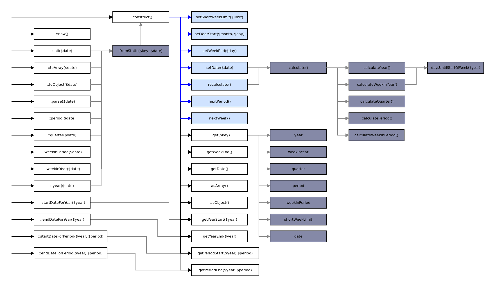

# Financial Calendar
Calculate the exact financial year, week-in-year, quarter, period, and week-in-period for any given date according to the Network Rail financial calendar.

## Installation

Financial Calendar may be used as a standalone class or as part of a Laravel project. Both Service Provider and Facade options are provided.

* PHP ^8
* Nesbot/Carbon ^2

You may include the library in your project using: `composer require networkrailbusinesssystems/financial-calendar`.

## Usage
The Financial Calendar class may be directly included or called through the Laravel service provider.

Out of the box, with or without a specific facade call, it can be used both as an instanced class and as a facade.

```php
$calendar = new FinancialCalendar('2018-05-08');

$calendar = FinancialCalendar::parse('2018-05-08');
``` 

### Date Formats
Out of the box this class supports dates in the following formats:

* 2018-07-01 (Y-m-d)
* 2018-07-01 00:00:00 (Y-m-d h:i:s)
* Carbon instance
* DateTime instance
* 1530403200 (Timestamp)

You may pass a specific format as the second parameter of any method that accepts a date.

```php
$calendar = new FinancialCalendar('01-01-2010', 'm-d-Y');

FinancialCalendar::parse('01-01-2010', 'm-d-Y');
```

Should you need support for another format, please submit a pull request.

### Year Start Dates
By default every financial year begins on April 1st. If you require a calendar that begins on another date, simply call the `setYearStart` function. 

#### Year Start Overrides
An array of known custom year starts can be supplied to `setYearStartOverrides`:

```php
[ year => [month, day] ]

$yearStartOverrides = [
    2017 => [4, 2]
];

$calendar->setYearStartOverrides($yearStartOverrides);
```

Any known year starts for the financial calendar have been preset. 

### Short Weeks
Sometimes the financial year is adjusted to prevent very short reporting weeks. This is compensated for with the following mechanisms:

#### Short Week Limit
If the first week of the financial year is shorter than the set short week limit, it is automatically extended to the end of the next full working week.

#### Week Length Overrides
Should the automatic short week limit be insufficient, or a long week is required anywhere other than the first week, an array of week lengths is available.

The array contains a set of years, with pairs of week numbers and the length of that week, which can be applied by calling `setWeekLengthOverrides`:

```php
[ year => [week => length] ]

$weekLengthOverrides = [
    2020 => [
        1 => 11
    ]
];

$calendar->setWeekLengthOverrides($weekLengthOverrides);
```

Any known week lengths for the financial calendar have been preset.

### Navigating the Calendar

Move the calendar to the next financial period or week:

```php
$calendar
    ->nextPeriod()
    ->nextWeek();
```

If you would find other calendar navigating methods useful, get in touch or submit a PR.

### Trait

If you are not storing the year and period in the database, or you need to be able to search for arbitrary dates based on a year or period in the financial calendar, you may use the `HasFinancialDates` trait on any eloquent model with an appropriate date column:

```php
$myModel->forFinancialYear(2001)->get();
$myModel->forFinancialPeriod(2001, 12)->get();
```

### Endpoints
You may utilise the calendar as an instanced or static class, and some commands support a fluent interface.

#### Instance

| Function              | Parameters       | Returns           | Fluent |
| --------------------- | ---------------- | ----------------- | :----: |
| new FinancialCalendar | $date, [$format] | self              |        |
| setShortWeekLimit     | $limit           | self              | Yes    |
| setYearStart          | $month, $day     | self              | Yes    |
| setWeekEnd            | $day             | self              | Yes    |
| setDate               | $date, [$format] | self              | Yes    |
| recalculate           |                  | self              | Yes    |
| nextPeriod            |                  | self              | Yes    |
| nextWeek              |                  | self              | Yes    |
| getYearStart          | $year            | Carbon            |        |
| getYearEnd            | $year            | Carbon            |        |
| getPeriodStart        | $year, $period   | Carbon            |        |
| getPeriodEnd          | $year, $period   | Carbon            |        |
| getWeekEnd            |                  | int               |        |
| getDate               |                  | Carbon            |        |
| asArray               |                  | array             |        |
| asObject              |                  | stdClass          |        |

| Property       | Type   |
| -------------- | ------ |
| date           | Carbon |
| year           | int    |
| weekInYear     | int    |
| quarter        | int    |
| period         | int    |
| weekInPeriod   | int    |
| shortWeekLimit | int    |

#### Static

| Function             | Parameters       | Returns           |
| -------------------- | ---------------- | ----------------- |
| ::all                | $date, [$format] | array             |
| ::toArray            | $date, [$format] | array             |
| ::toObject           | $date, [$format] | stdClass          |
| ::parse              | $date, [$format] | FinancialCalendar |
| ::period             | $date, [$format] | int               |
| ::quarter            | $date, [$format] | int               |
| ::weekInPeriod       | $date, [$format] | int               |
| ::weekInYear         | $date, [$format] | int               |
| ::year               | $date, [$format] | int               |
| ::startDateForYear   | $year            | Carbon            |
| ::endDateForYear     | $year            | Carbon            |
| ::startDateForPeriod | $year, $period   | Carbon            |
| ::endDateForPeriod   | $year, $period   | Carbon            |



## Testing
This helper has been tested using PHPUnit for accuracy and functionality, tested against actual calendar data.

* 54 tests with 8103 assertions
* Calculations verified for 2004 - 2035
* Date Calculation
* Accepted Date Formats
* Class Usage
